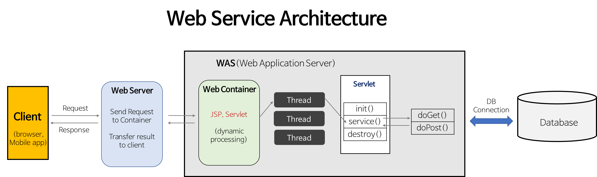

# spring-tutorial-22nd
CEOS 백엔드 22기 스프링 튜토리얼
<hr/>

# 1. Spring이 지원하는 기술들

 
## 1) IoC/DI : Inversion of Control / Dependency Injection

### IoC : 제어의 역전
IoC는 객체의 생성부터 생명주기 관리까지, 모든 것을 개발자가 아닌 프레임워크(**Spring 컨테이너**)가 대신 해주는 설계 원칙입니다.

### DI : 의존성 주입
IoC라는 개념을 구현하는 구체적인 방법 중 하나로 클래스가 필요로 하는 의존 객체를 외부의 프레임워크(**Spring 컨테이너**)가 주입해주는 패턴입니다.


```java
// 생성자 주입 - 권장!
@Component
public class MemberServiceImpl implements MemberService {

    private final MemberRepository memberRepository;

    @Autowired
    public MemberServiceImpl(MemberRepository memberRepository) {
        this.memberRepository = memberRepository;
    }
}
```

```java
// 수정자 주입
@Component
public class OrderServiceImpl implements OrderService {

    // setter의 경우 final이 생략되어야 함 ->  변경 가능
    private MemberRepository memberRepository;

    @Autowired
    public void setMemberRepository(MemberRepository memberRepository) {
        this.memberRepository = memberRepository;
    }
}
```

```java
// 필드 주입
@Component
public class OrderServiceImpl implements OrderService {

    @Autowired private MemberRepository memberRepository;
    @Autowired private DiscountPolicy discountPolicy;
}
```

## 2) AOP (Aspect Oriented Programming)
AOP는 애플리케이션의 핵심 비즈니스 로직과 여러 곳에서 반복적으로 나타나는 공통 부가 기능을 분리하여 개발하는 방식입니다. 여기서 부가 기능을 관점(Aspect)이라고 부르며, 이를 모듈화하여 관리합니다.
대표적인 부가기능으로는 **로깅, 성능 측정, 보안, 트랜젝션 관리** 등이 있습니다.

AOP를 코드에 적용할 경우 아래와 같은 장점이 있습니다.
- **코드 중복 제거**을 제거하여 여러 클래스에 흩어져 있던 로그나 트랜잭션 코드를 한 곳에서 관리할 수 있습니다.
- 개발자는 순수한 비즈니스 로직에만 집중할 수 있어 코드가 깔끔해집니다.
- 부가 기능에 변경이 필요할 때, 해당 Aspect 파일만 수정하면 되므로 **유지보수가 용이**해집니다.

- [용어 정리]
  - Aspect: 부가 기능을 정의한 '모듈' 그 자체 
  - Advice: Aspect가 해야 하는 '실제 작업' 내용 
  - Join Point: Advice가 적용될 수 있는 '위치' 
  - Pointcut: 여러 Join Point 중에서 Advice를 어디에 적용할지 선별하는 '조건/규칙'.
  - Target: Advice가 적용되는 '대상 객체'

```java
// 성능 측정 관련 Aspect 적용 사례

@Aspect // 이 클래스가 Aspect임을 선언
@Component
public class PerformanceAspect {

    // Pointcut: 어디에 적용할지 정의
    // com.example.service 패키지 아래의 모든 클래스, 모든 메서드에 적용함을 의미
    @Pointcut("execution(* com.example.service..*.*(..))")
    private void allServiceMethods() {}

    // Advice: 어떤 작업을 할지 정의
    // @Around: 메서드 실행 전후에 개입
    @Around("allServiceMethods()")
    public Object measureExecutionTime(ProceedingJoinPoint joinPoint) throws Throwable {
        long startTime = System.currentTimeMillis();

        Object result = joinPoint.proceed(); // 원래의 Target 메서드 실행

        long endTime = System.currentTimeMillis();
        long executionTime = endTime - startTime;

        System.out.println("[Performance] " + joinPoint.getSignature() + " 실행 시간: " + executionTime + "ms");
        
        return result;
    }
}
```

## 3) PSA (Portable Service Abstraction)
추상화를 통해 스프링의 내부 구현이 변경되거나 동일 기능에 대한 다른 기술을 사용하더라도 동일한 포멧으로 개발자가 사용 가능할 수 있도록 하는 스프링의 핵심 원칙입니다.
이 방법을 통해 특정 기술에 대한 종속성을 줄이고 유연하고 확장성있는 개발이 가능하며 모든 코드 구조를 알지 않아도 되므로 코드가 간결해집니다.

```java
@Service
public class OrderService {

    @Autowired
    private OrderRepository orderRepository;

    // PSA의 대표적인 예시: @Transactional
    // 이 Annotation 하나로 어떤 DB 접근 방식을 사용하던 트랜잭션 처리를 하나도 통일하여 사용할 수 있도록 합니다
    // 내부에서 어떤 트랜잭션 기술을 사용하는지 알 필요가 없습니다.
    @Transactional
    public void placeOrder(Order order) {
        // 주문 로직
        orderRepository.save(order);

        if (order.isProblematic()) {
            throw new RuntimeException("문제가 있는 주문입니다.");
        }
    }
}
```
<hr/>

# 2. Spring Bean

## 1) Spring Bean이란?

**Spring IoC 컨테이너가 관리하는 자바 객체**입니다.


## 2) annotation (@)
- 코드에 특별한 의미를 부여하고 추가적인 정보를 제공하는 메타데이터의 한 종류로 컴파일러나 프레임워크에게 유용한 정보를 제공하는 역할을 수행합니다.
- 스프링에서 사용하는 대표적인 어노테이션은 다음과 같습니다.
  - ``@Component``: 가장 기본이 되는 어노테이션으로, "이 클래스는 Spring이 관리해야 할 대상이야"라고 알려주는 표식입니다.
  - 아래 어노테이션들은 `@Component`를 포함하고 있어 기능은 동일하지만, 계층별로 역할을 명확히 구분하기 위해 사용됩니다.
      - ```@Controller```: 웹 요청과 응답을 처리하는 컨트롤러 클래스에 사용됩니다.
      - `@Service`: 핵심 비즈니스 로직을 처리하는 서비스 클래스에 사용됩니다.
      - `@Repository`: 데이터베이스에 접근하는 DAO 클래스에 사용됩니다.
      - `@Configuration`: 설정을 위한 클래스임을 명시하며, @Bean 어노테이션과 함께 사용되어 수동으로 빈을 등록할 때 사용됩니다.


## 3) Bean 등록 

스프링 빈을 등록하는 방법은 크게 두 가지로 나뉩니다.

### 1. 컴포넌트 스캔
Spring이 지정된 패키지 이하를 자동으로 스캔하여 특정 어노테이션이 붙은 클래스들을 찾아 알아서 빈으로 등록하는 방식입니다.

```java
// @Component의 역할을 하는 @Service 어노테이션
@Service
public class MyUserService {
    // ... 비즈니스 로직
}
```

### 2. 수동 등록.
설정 파일에 직접 빈을 정의하는 방식입니다. 주로 외부 라이브러리의 클래스처럼 소스 코드를 수정할 수 없는 경우나, 복잡한 설정이 필요한 경우에 사용됩니다.
- `@Configuration`: 이 클래스가 Spring의 설정을 담고 있는 클래스임을 나타냅니다.
- `@Bean`: @Configuration이 붙은 클래스 내의 메서드에 사용되며, 이 메서드가 반환하는 객체를 스프링 빈으로 등록하라고 지시합니다.

```java
@Configuration // 설정 파일임을 나타냅니다.
public class AppConfig {

    // 이 메서드가 반환하는 객체를 빈으로 등록합니다.
    @Bean
    public UserService createUserService() {
        UserService userService = new UserService();
        return userService;
    }
}
```

### Spring Bean이 등록되는 과정
#### 1. 애플리케이션 시작 및 컴포넌트 스캔
- Spring Application이 실행되며 빈팩토리가 생성됩니다.
- SpringApplication.run()이 실행되면, `@SpringBootApplication` 어노테이션을 시작점으로 탐색합니다.
- `@SpringBootApplication` 안에는 `@ComponentScan`이 포함되어 있어, 메인 클래스가 위치한 패키지와 그 하위 패키지 전체를 스캔하기 시작합니다.

#### 2. Bean Definition 생성
- 컴포넌트 스캔 과정에서 @Component 및 파생 annotation들(`@Controller`,` @Service`, `@Repository `등)을 스캔하여 이들을 어떻게 빈으로 만들지에 대한 정보인 ``BeanDefinition`` 객체를 생성하여 ``BeanDefinitionResistry``에 저장합니다.
- `@Configuration` 클래스에 있는` @Bean `메서드들도 마찬가지로 스캔하여 ``BeanDefinition``을 생성합니다.

#### 3. 빈 생성 및 의존관계 주입
- ``BeanDefinitionRegistry``에 저장된 모든 ``BeanDefinition``들을 바탕으로, ``BeanFactory``(ApplicationContext)가 실제 빈 객체 인스턴스를 생성하기 시작합니다.
- 이 과정에서 의존관계 주입(DI)이 발생합니다. 

#### 4. 빈 컨테이너에 저장 및 사용
- 의존관계 주입까지 완료된 빈 싱글톤 객체들은 스프링 컨테이너에 저장됩니다.
- 어플리케이션의 다른 부분에서 해당 타입의 빈을 @Autowired로 요청하면, Spring 컨테이너는 이미 만들어둔 이 빈 객체를 반환해줍니다. 

## 5) 하나의 interface를 구현한 service가 여러개 있을때 어떻게 주입 해야할까?

하나의 인터페이스를 구현한 service가 여러개일 경우, 의존관계 주입 시 어떤 Bean을 주입해야할 지 알 수 없으므로 ``NoUniqueBeanDefinitionException``이 발생합니다.
아래는 예시 상황입니다.

```java
// 인터페이스
public interface PaymentService {
    void pay();
}

// 구현체 1
@Service
public class KakaoPayService implements PaymentService {
    @Override
    public void pay() {
        System.out.println("카카오페이로 결제합니다.");
    }
}

// 구현체 2
@Service
public class NaverPayService implements PaymentService {
    @Override
    public void pay() {
        System.out.println("네이버페이로 결제합니다.");
    }
}
```

위와 같이 두개의 구현체가 존재하는 인터페이스에 대해 아래 코드처럼 의존관계 주입이 실시되면 ``NoUniqueBeanDefinitionException``이 발생합니다.
```java
@Service
public class OrderService {

    private final PaymentService paymentService;

    // 생성자 주입 시도 -> Error!!
    public OrderService(PaymentService paymentService) {
        this.paymentService = paymentService;
    }

    public void order() {
        paymentService.pay();
    }
}
```

이를 해결하기 위한 방법으로는 크게 두가지가 있습니다.

### 1. `@Qualifier`
- 각 구현체에 `@Qualifier` Annotation을 활용하여 명확한 이름을 지정하고 이를 활용하여 의존관계를 주입하는 방식입니다.
- 위의 문제 상황에 대한 코드를 아래 처럼 개선할 수 있습니다.
```java
@Service
@Qualifier("kakaoPay") // "kakaoPay"라는 이름표를 붙여줍니다.
public class KakaoPayService implements PaymentService {
    // ...
}

@Service
@Qualifier("naverPay") // "naverPay"라는 이름표를 붙여줍니다.
public class NaverPayService implements PaymentService {
    // ...
}
```

```java
@Service
public class OrderService {

    private final PaymentService paymentService;

    // 주입 시점에 @Qualifier를 사용하여 "kakaoPay"라는 이름표가 붙은 빈을 주입해달라고 명시한다.
    public OrderService(@Qualifier("kakaoPay") PaymentService paymentService) {
        this.paymentService = paymentService;
    }
}
```


### 2. `@Primary`
- `@Primary` 어노테이션은 여러 개의 빈 중에서 우선적으로 주입될 기본(Default) 빈을 설정하는 방법입니다.
- 본 어노테이션을 사용할 경우 아래처럼 개선이 가능합니다.
```java
@Service
@Primary // PaymentService 타입의 빈을 주입할 때 우선권을 가짐을 선언합니다.
public class KakaoPayService implements PaymentService {
    // ...
}

@Service // 우선권이 없는 상황입니다.
public class NaverPayService implements PaymentService {
    // ...
}
```
```java
@Service
public class OrderService {

    private final PaymentService paymentService;

    // 별도의 어노테이션 없이도 @Primary가 붙은 KakaoPayService가 자동으로 주입됩니다.
    public OrderService(PaymentService paymentService) {
        this.paymentService = paymentService;
    }
}
```

<hr/>

# 3. Spring MVC

## 1) MVC 패턴
MVC 패턴이란, Model, View, Controller의 세 가지 구성 요소로 애플리케이션을 분리하는 소프트웨어 설계 패턴입니다.

- Model: 애플리케이션의 데이터와 비즈니스 로직을 담당, 데이터베이스와 상호작용하며 데이터의 상태 변경을 처리합니다.
- View: 사용자에게 보여줄 UI 구성을 담당, 모델의 데이터를 시각적으로 표현하는 역할입니다.
- Controller: 사용자의 입력을 받아 모델의 상태 변경을 요청하거나, 적절한 View로 전달하는 역할을 수행합니다.

이때, Spring MVC란, MVC 디자인 패턴을 구현한 Java 기반의 웹 프레임워크를 말합니다.

## 2) Servelet이란?
Servelet이란 자바를 사용하여 웹 요청과 응답을 처리하는 서버 측 프로그램이자 자바 클래스입니다. 클라이언트(웹 브라우저)의 요청을 받아 동적인 웹 콘텐츠를 생성하여 응답에 관여하며 각 요청을 별도의 thread로 처리하여 효율성을 높인 방식입니다.

#### 서블렛을 활용한 웹 요청 처리 과정
1. **사용자 요청**: 사용자가 브라우저에 URL을 입력하면 HTTP 요청이 웹 서버로 전송됩니다.
2. **서블릿 컨테이너 전달**: 웹 서버는 이 요청을 직접 처리하지 않고, 서블릿을 관리하는 서블릿 컨테이너(Servlet Container)에게 전달합니다.
3. **서블릿 객체 생성 및 실행**: 서블릿 컨테이너는 요청 URL에 매핑된 서블릿이 메모리에 있는지 확인합니다.
4. **분기**
    - **4-1. 매핑된 서블릿이 없다면**: 서블릿 클래스를 로딩하고, `init()` 메서드를 호출하여 초기화한 후, 요청을 처리할 스레드를 생성합니다.
    - **4-2. 매핑된 서블릿이 있다면**: 이미 생성된 서블릿 객체를 재사용하여 스레드를 생성합니다.
5. **로직 수행**: 생성된 스레드에서 서블릿의 `service()` 메서드가 호출됩니다. 이 메서드는 요청의 종류(`GET`, `POST` 등)에 따라 `doGet()`이나 `doPost()` 같은 메서드를 다시 호출하여 실제 비즈니스 로직을 수행합니다.
6. **응답 생성 및 전송**: 서블릿은 로직 수행 결과를 담은 HTTP 응답(HTML, JSON 등)을 생성하여 서블릿 컨테이너에게 전달하고, 컨테이너는 이 응답을 웹 서버를 통해 사용자에게 보냅니다.
7. **서블릿 소멸**: 서버가 종료되거나 서블릿이 재로딩될 때 `destroy()` 메서드가 호출되어 서블릿은 메모리에서 소멸됩니다.

## 3) 톰켓과 WAS



웹에서는 Client의 요청을 정적, 동적 요청으로 구분하며 Web Server는 이 중 정적인 요청에 대한 응답을 담당합니다. 
동적인 요청이 들어왔을 경우, Web Server는 이 요청을 동적 처리가 가능한 WAS로 전달하여 응답을 제공하기 위해 필요한 로직을 수행합니다. 
응답을 제공하는 과정에서 Servlet이 생성되며 앞서 제시한 Servlet을 활용한 웹 요청 처리 과정이 발생합니다.

- WAS(Web Application Server) : 웹 서버에서 처리하기 어려운 동적인 콘텐츠를 처리하는 소프트웨어입니다.
- 톰캣(Tomcat)은 대표적인 자바 기반 WAS(Web Application Server)로, 웹 서버의 기능과 애플리케이션 서버의 기능을 모두 처리할 수 있습니다.
- 또한 톰캣은 앞서 Servlet을 이용한 웹 요청 처리 과정에서 필요한 서블렛 컨테이너 기능을 수행하는 가장 대표적인 구현체입니다.


## 4) Dispatcher Servlet과 동작 흐름

Dispatcher Servlet은 Spring MVC의 핵심으로 모든 Client의 요청을 가장 먼저 받아서 처리할 컨트롤러에게 넘겨주고, 컨트롤러가 반환한 결과를 받아 최종 뷰를 생성하여 클라이언트에게 응답하는 프론트 컨트롤러 역할을 합니다. 
이 덕분에 개발자는 웹 요청을 받아오고 응답을 반환하는 부분이 아닌 내부 컨트롤러의 구현에만 집중할 수 있습니다.

Dispatcher Servlet의 동작 흐름은 다음과 같습니다.
1. **요청 접수**
   - 클라이언트로부터 HTTP 요청이 들어오면, Servlet Container가 이 요청을 Dispatcher Servlet에게 전달

2. **핸들러 조회**
    - `mappedHandler = getHandler(processedRequest)`
    - Dispatcher Servlet은 요청받은 URL, HTTP 메서드 등의 정보를 바탕으로 `getHandler` 메소드를 통해 이 요청을 처리할 컨트롤러(핸들러)가 누구인지 찾습니다.

3. **HandlerAdapter 선택**
    - `ha = getHandlerAdapter(mappedHandler.getHandler())`
    - 적절한 컨트롤러를 찾으면, Dispatcher Servlet은 HandlerAdapter에게 해당 컨트롤러를 실행할 수 있는 어댑터가 있는지 확인합니다.

4. **조건부 GET/HEAD (Last-Modified)**
    - GET/HEAD이면 `ha.getLastModified(...)` →
      `new ServletWebRequest(request, response).checkNotModified(lastModified)`
    - 브라우저가 가진 캐시 데이터가 최신의 데이터임을 확인하면 내부 컨트롤러 수행이 필요 없으므로 **304 Not Modified**로 그대로 종료합니다.

5. **인터셉터 사전 처리**
    - `mappedHandler.applyPreHandle(processedRequest, response)`
    - 핸들러 인터셉터란 컨트롤러로 들어오는 요청(Request)과 컨트롤러가 반환하는 응답(Response)을 가로채서 특정 작업을 처리할 수 있게 해주는 장치를 말합니다.
    - `preHandle` 중 하나라도 **false**면 인터셉더 단에서 요청을 막은 것으로 즉시 처리를 종료합니다
    - 주로 로그인, 권한 체크, 로깅 등에 활용됩니다.

6. **핸들러 실제 호출**
    - `mv = ha.handle(processedRequest, response, mappedHandler.getHandler())`
    - 실제 컨트롤러를 실행하고 반환하는 결과(데이터, 뷰)를 `ModelandView` 객체에 저장해둡니다.

7. **비동기 시작 여부 체크**
    - `if (asyncManager.isConcurrentHandlingStarted()) return;`
    - 컨트롤러에서의 작업이 오래 걸리는 경우, 비동기 방식 처리에서는 DispatcherServlet은 현재 스레드의 작업을 즉시 종료하고 스레드를 타 요청 처리를 위해 반납합니다.
    - 비동기 작업이 다른 스레드에서 완료 되었을 때, 다시 요청 처리가 재개되어 뷰 랜더링 등을 시작합니다.

8. **기본 뷰 이름 & 사후 처리**
    - `applyDefaultViewName(processedRequest, mv)`로 뷰의 이름을 지정합니다.
    - `mappedHandler.applyPostHandle(processedRequest, response, mv)`
    - 인터셉터의 `postHandle` 메소드를 통해 컨트롤러 실행 직후 뷰가 랜더링 하기 전 모델과 뷰(ModelandView)에 대한 수정이 진행됩니다.
    - 모든 페이지에 공통적으로 필요한 사용자 정보, 메뉴 목록 등을 모델에 저장하는 등의 작업을 수행합니다.
9. **결과 처리(렌더링/예외 매핑)**
    - `processDispatchResult(processedRequest, response, mappedHandler, mv, dispatchException)`
    - DispatcherServlet이 View 객체에 Model 데이터를 전달하여 최종 HTML을 생성하고, 이 결과를 response에 담아 클라이언트에게 보냅니다


10. **정리(finally)**
    - **비동기**: `applyAfterConcurrentHandlingStarted(...)`로 비동기 상황에 맞게 인터셉터가 동작하도록 관리합니다.
    - **동기**: 멀티파트였다면 `cleanupMultipart(processedRequest)` 로 불필요한 임시 파일들을 삭제합니다.


